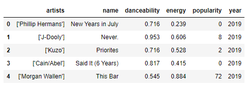

Side notes to delete when file is complete 
#what data did you collect
11:50
#what's its purpose
11:50
#how did you clean it
11:50
#what's the table structure
11:50
#get it into sql

# PROJECT-2
# ETL Project 

Members: Laurel, Mercan, David, Luke

###  Data on most popular songs played on Spotify and Billboard though 1999-2019

Our teams purpose on completing this project was based on songs that were most popular through the past years. We gathered data to see the most often songs that people listened to on the Spotify and Billboard music apps  Our team members did a fantastic job by coming up with different strategies to clean, join, filter and manipulate data. Take a peek!

### Sources of data:

Kaggle-  Spotify Dataset 1921-2020, 160k+ Tracks (csv)
https://www.kaggle.com/yamaerenay/spotify-dataset-19212020-160k-tracks 

Kaggle:  Song lyrics from 6 musical genres (csv)
https://www.kaggle.com/neisse/scrapped-lyrics-from-6-genres

Kaggle:  Data on Songs from Billboard 1999-2019 (csv)
https://www.kaggle.com/danield2255/data-on-songs-from-billboard-19992019

### Transformation of the data: 

 <ins> Spotify Dataset 1921-2020, 160k+ Tracks (csv) </ins> 
* Intial dataframe had 19 columns - Eliminated data outside specified timeframe (1999-2019).
* Created a new dataframe and sorted the data by artists, name, danceability, energy, popularity, year:

<ins> Song lyrics from 6 musical genres (csv) </ins> 
* Used stopword-removing function to eliminate meaningless words in lyrics.
* This allows us to identify keywords in songs (organized by genre).
* Creation of a word cloud to illustrate trends in genre lyrics:

<ins> Data on Songs from Billboard 1999-2019 (csv)</ins>

*  We first narrowed down columns from the initial dataframe, sorted a new Billboard dataframe by: Artists, Name, Weekly.rank, Weeks.on.chart, Date, Genre:

* The intial file had multiple artist and genres within a single column. We had to split these out to make the data more user friendly.

* Then we cleaned up the dataframe and dropped two columns to create our final table:

### Transforming of seperate csv files.

* We merged the final Spotify and the Billboard data csv files:

* After merging the Spotify and Billboard csv files, many rows had duplicates for various columns; 
	* We figured this was because there were different tracks of the same song released as compilation efforts or released on different dates.

* 

### Type of final production database data is loaded into:

We used a relational database (PostgreSQL) to link and...

### Final conclusion 

